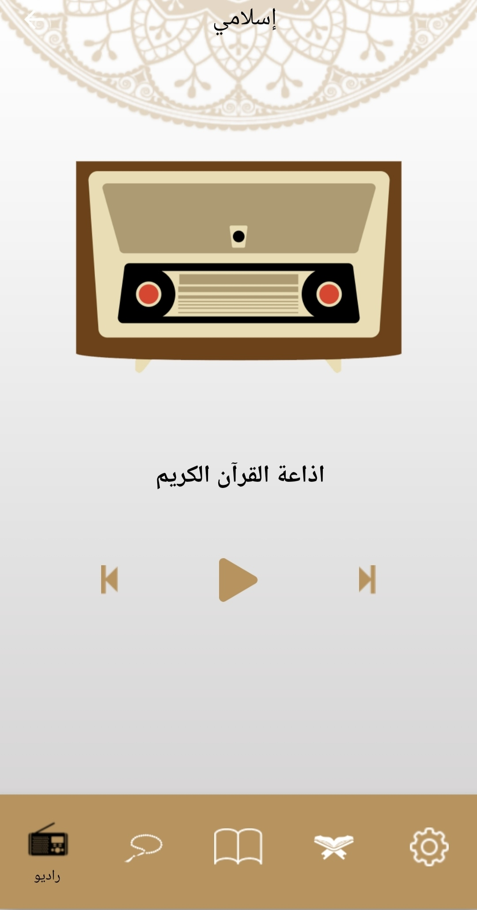
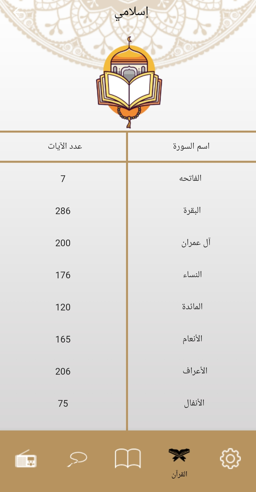
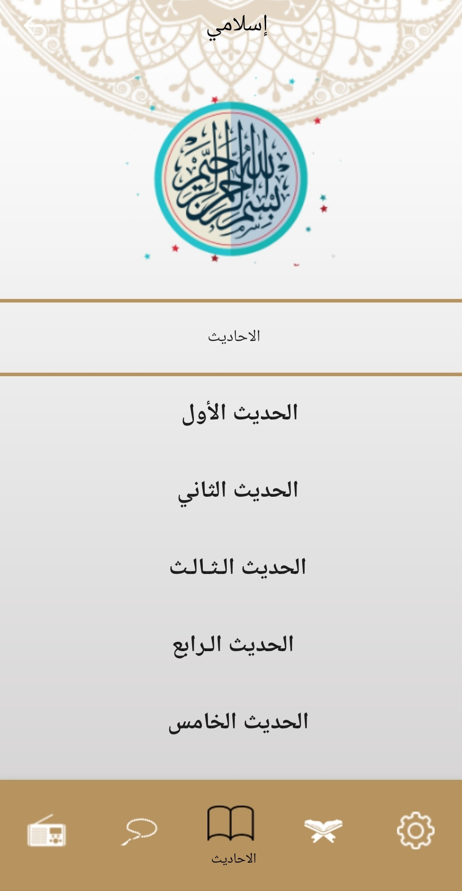
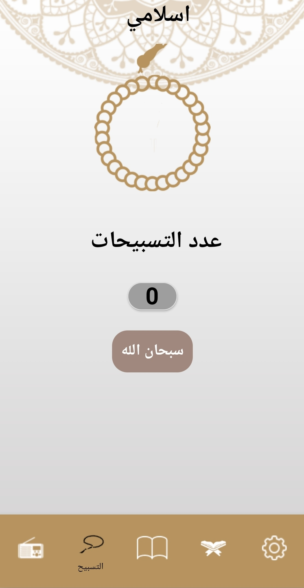

# islami_app
* ### islamic application using dart
* ### An application provide ability to read Quran and hadeth
* ### The application consists of:
  * Quran radio
     
    
  * Quran's surahs
      
     
  * ahadeth
      
     
  * tasbe7
      
     
